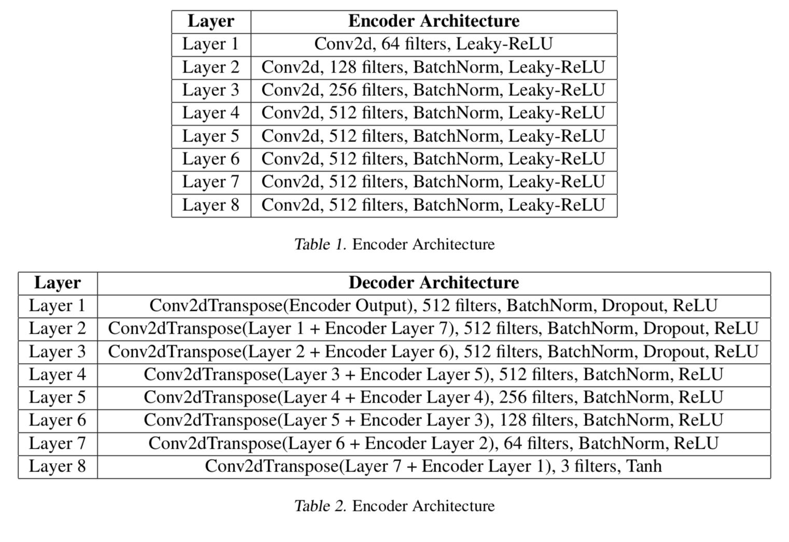
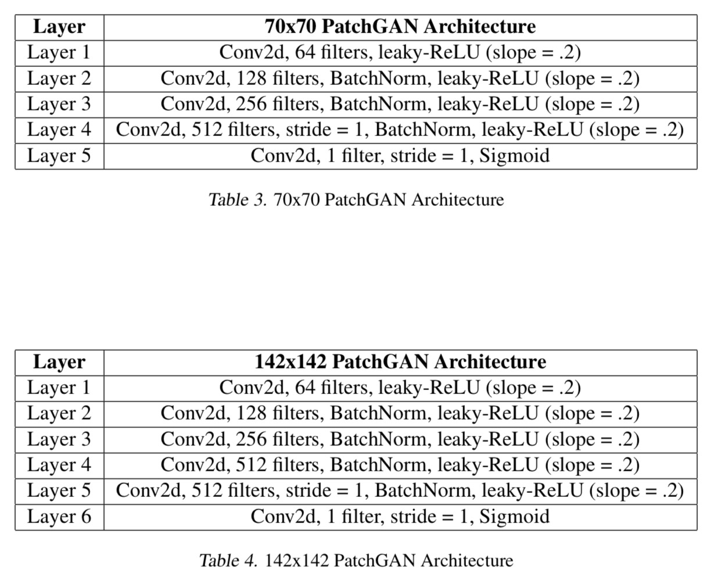

# modified-pix2pix
pix2pix Pytorch Implementation

We followed the pix2pix model architecture as suggested by the authors in the original [Paper](https://arxiv.org/abs/1611.07004) with the following changes:  
* Dropout at only first 3 layers of decoder  
* Discriminator with receptive field size of 1, 70, 142, and 286

Our implementation includes:  
* Skip connections in the generator  
* Added discriminator receptive field size options

  

